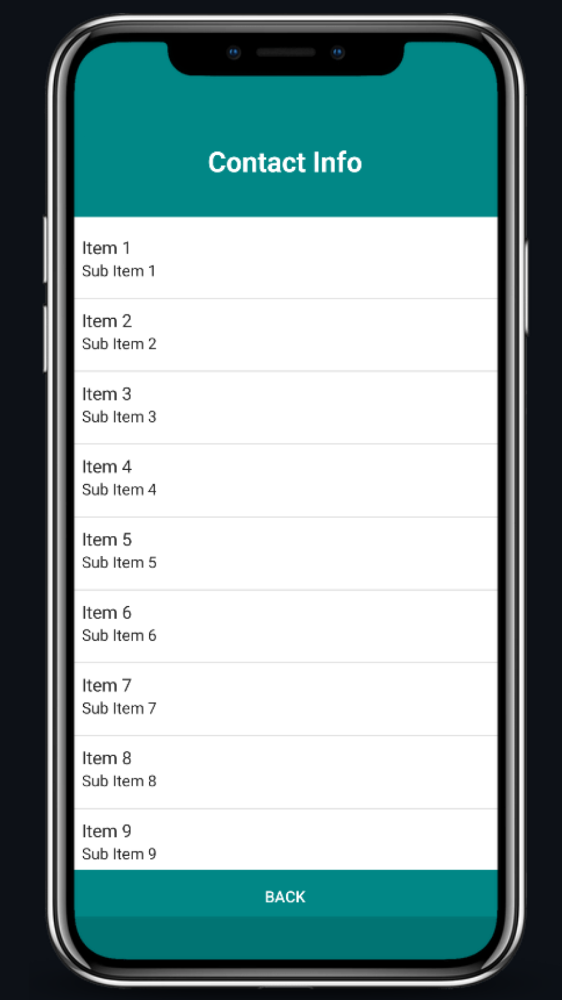

# contact-form-java 

Scientific Calculator App using java. API version 26

#### Use local database (SQLite) to store data persistently
- Use of the SQLiteDatabaseHelper class
- Insert/update/delete/select data from SQLite database

#### Create a table to store the event information in SQLite database
- Two columns (key, value)
- Generate unique key
- Concatenate event values to represent value
- Retrieve the event information from database for an event key and print them on
console

## Screenshots

